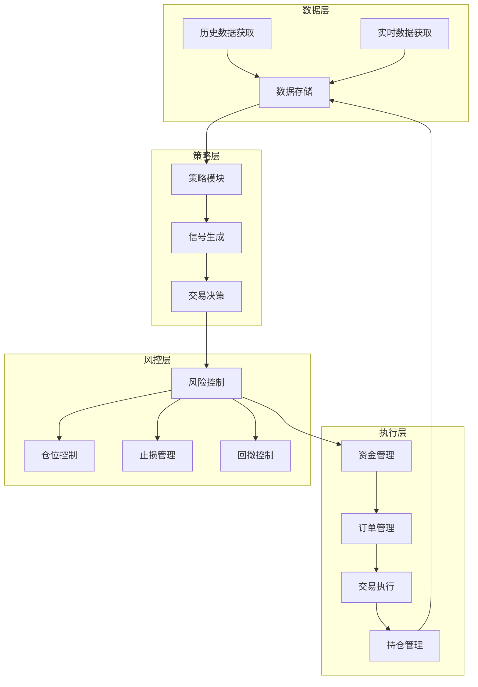
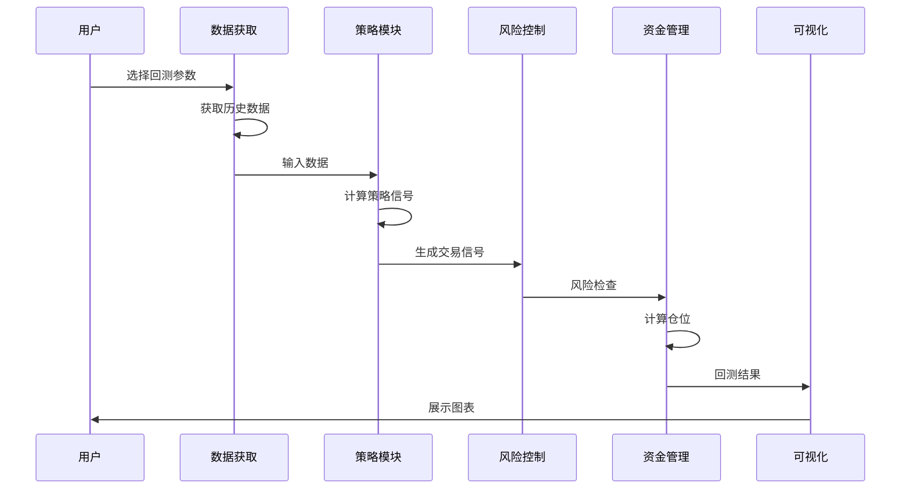
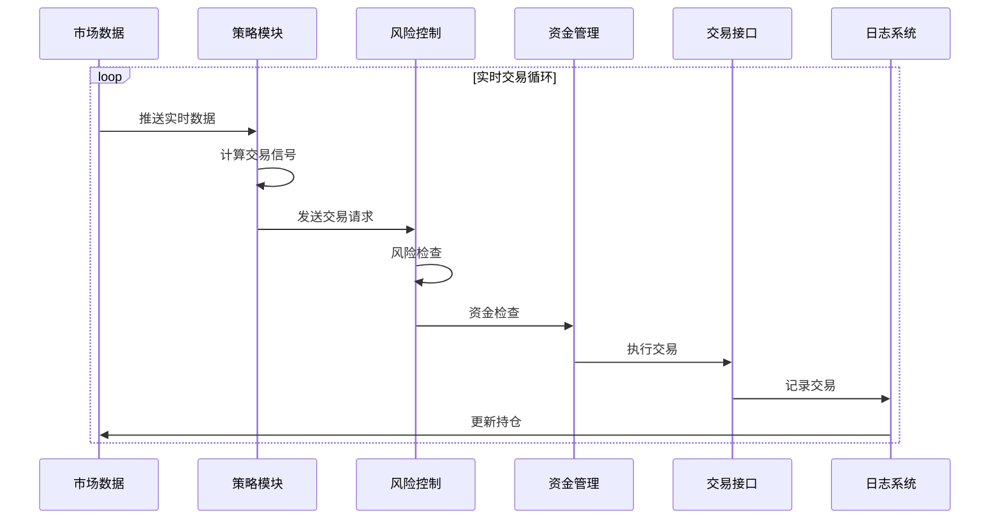
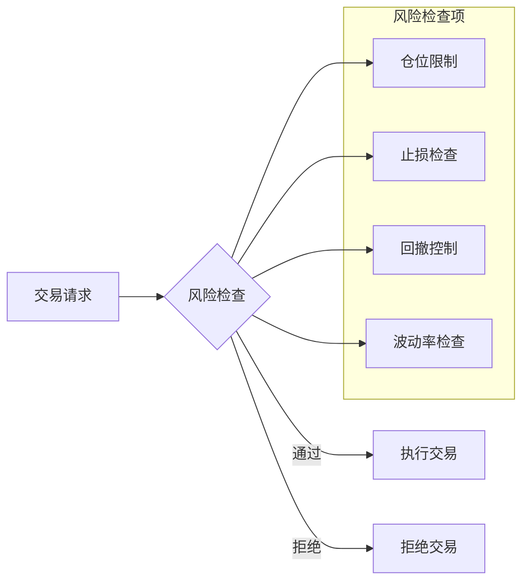
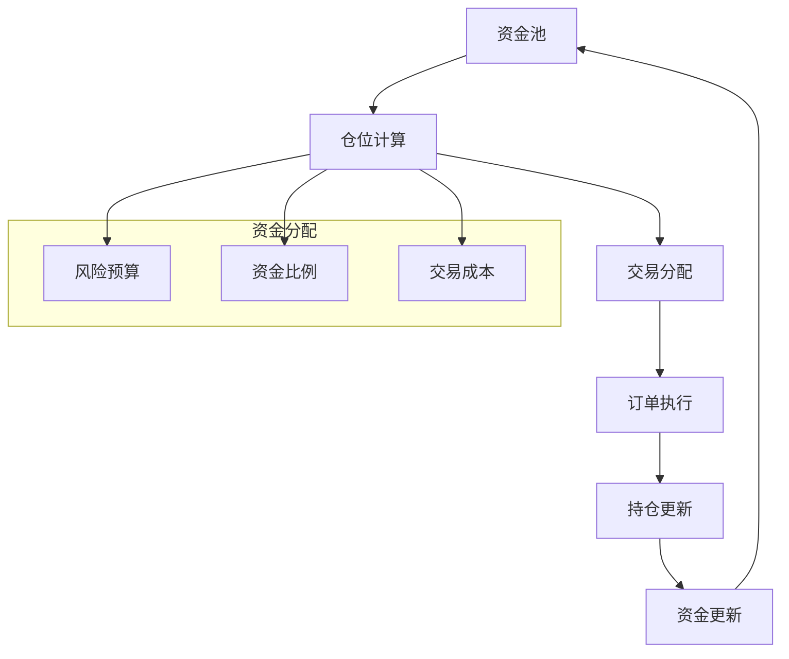
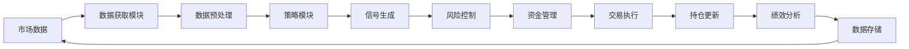

# 量化交易系统流程图

## 系统整体架构

```mermaid
graph TB
    subgraph 数据层
        A1[历史数据获取] --> B1[数据存储]
        A2[实时数据获取] --> B1
    end

    subgraph 策略层
        C1[策略模块] --> D1[信号生成]
        D1 --> E1[交易决策]
    end

    subgraph 风控层
        F1[风险控制] --> G1[仓位控制]
        F1 --> G2[止损管理]
        F1 --> G3[回撤控制]
    end

    subgraph 执行层
        H1[资金管理] --> I1[订单管理]
        I1 --> J1[交易执行]
        J1 --> K1[持仓管理]
    end

    B1 --> C1
    E1 --> F1
    F1 --> H1
    K1 --> B1
```

## 回测流程

```mermaid
sequenceDiagram
    participant U as 用户
    participant D as 数据获取
    participant S as 策略模块
    participant R as 风险控制
    participant M as 资金管理
    participant V as 可视化

    U->>D: 选择回测参数
    D->>D: 获取历史数据
    D->>S: 输入数据
    S->>S: 计算策略信号
    S->>R: 生成交易信号
    R->>M: 风险检查
    M->>M: 计算仓位
    M->>V: 回测结果
    V->>U: 展示图表
```

## 实盘交易流程

```mermaid
sequenceDiagram
    participant M as 市场数据
    participant S as 策略模块
    participant R as 风险控制
    participant F as 资金管理
    participant T as 交易接口
    participant L as 日志系统

    loop 实时交易循环
        M->>S: 推送实时数据
        S->>S: 计算交易信号
        S->>R: 发送交易请求
        R->>R: 风险检查
        R->>F: 资金检查
        F->>T: 执行交易
        T->>L: 记录交易
        L->>M: 更新持仓
    end
```

## 风险控制流程

```mermaid
graph LR
    A[交易请求] --> B{风险检查}
    B -->|通过| C[执行交易]
    B -->|拒绝| D[拒绝交易]
    
    subgraph 风险检查项
        E[仓位限制]
        F[止损检查]
        G[回撤控制]
        H[波动率检查]
    end
    
    B --> E
    B --> F
    B --> G
    B --> H
```

## 资金管理流程

```mermaid
graph TB
    A[资金池] --> B[仓位计算]
    B --> C[交易分配]
    C --> D[订单执行]
    D --> E[持仓更新]
    E --> F[资金更新]
    F --> A
    
    subgraph 资金分配
        G[风险预算]
        H[资金比例]
        I[交易成本]
    end
    
    B --> G
    B --> H
    B --> I
```

## 数据流转图

```mermaid
graph LR
    A[市场数据] --> B[数据获取模块]
    B --> C[数据预处理]
    C --> D[策略模块]
    D --> E[信号生成]
    E --> F[风险控制]
    F --> G[资金管理]
    G --> H[交易执行]
    H --> I[持仓更新]
    I --> J[绩效分析]
    J --> K[数据存储]
    K --> A
``` 